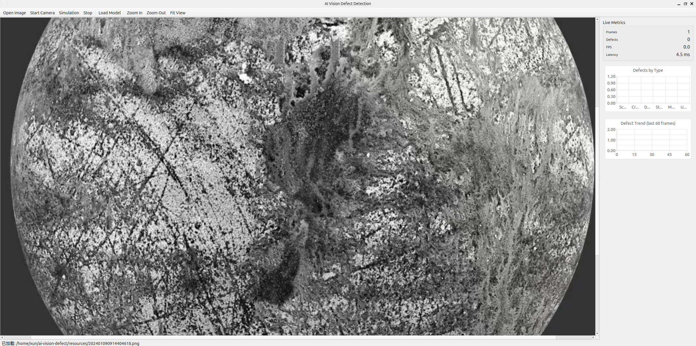

# AI 视觉缺陷检测客户端

面向工业流水线的智能视觉检测客户端，基于 **C++11**、**Qt5**、**OpenCV** 与 **YOLOv5/v8** 构建。支持超大分辨率图像的零拷贝渲染、异步 AI 推理流水线，以及实时 ROI 轮廓绘制与缺陷数据统计看板。

---

## 界面预览

| 主视图（ROI 标注）|
|---|---|
|  |

---

## 核心特性

- **零拷贝渲染** — 利用 `QImage` 指向外部数据的构造函数，将 `cv::Mat` 像素缓冲区直接共享给 Qt 渲染层，省去每帧渲染的全量内存拷贝（1080p~4K 单帧 6~25 MB）。
- **对象池** — `FramePool` 预分配固定数量的图像缓冲区，通过 `std::shared_ptr` 自定义删除器自动回收，消除高频帧分配带来的堆碎片与延迟抖动。
- **异步生产者-消费者流水线** — 图像采集、AI 推理、UI 渲染三阶段独立线程解耦，通过有界队列传递，`std::move` 右值语义跨线程转移帧所有权，无额外拷贝。
- **YOLO 缺陷检测** — 封装 OpenCV DNN 加载 ONNX 格式 YOLOv5/v8 模型，支持可选 CUDA 加速。可识别缺陷类型：`划痕`、`裂纹`、`凹陷`、`污渍`、`缺失`。
- **ROI 覆盖层** — `DefectOverlay`（`QGraphicsObject` 子类）在图像像素坐标系中绘制半透明边界框、精细轮廓多边形与置信度标签，随视图缩放自动适配。
- **实时统计看板** — 按缺陷类型实时更新柱状图与滚动趋势折线图（Qt Charts）。
- **内存安全生命周期** — 所有跨线程资源均由带自定义删除器的 `std::shared_ptr` 管理，经 Valgrind Memcheck 压力测试，泄漏归零。

---

## 系统架构

```
┌──────────────────────────────────────────────────────────────────┐
│   采集线程                  推理线程                GUI 线程      │
│                                                                   │
│  ImagePipeline            InferenceEngine         MainWindow     │
│  ┌──────────┐  FramePtr  ┌───────────────┐      ┌───────────┐   │
│  │  相机    │─(std::move)▶│  YoloDetector │─────▶│ Renderer  │   │
│  │  / 图片  │             │  (ONNX/DNN)   │      │ + Overlay │   │
│  │  / 仿真  │             └───────────────┘      ├───────────┤   │
│  └────┬─────┘                                    │  Stats    │   │
│       │ acquire()                                │  Panel    │   │
│  ┌────▼─────┐                                    └───────────┘   │
│  │FramePool │◀──── 自定义删除器归还缓冲区 ───────────────────────  │
│  │ (8 槽位) │                                                     │
│  └──────────┘                                                     │
└──────────────────────────────────────────────────────────────────┘
```

### 关键设计决策

| 决策 | 原因 |
|---|---|
| `QImage` 包装 `cv::Mat` 外部数据 | 每帧省去一次全量拷贝，1080p 下节省约 6 MB 数据传输 |
| 对象池 + 自定义删除器 | 预分配消除 GC 压力；即使线程异常退出，删除器也能保证缓冲区安全回收 |
| 有界推理队列（深度 4） | 提供背压机制，推理过慢时丢弃最旧帧，防止队列无限增长 |
| `std::move` 跨线程传递 | O(1) 所有权转移，热路径上无引用计数开销 |
| `shared_ptr<cv::Mat>` + 自定义删除器 | Valgrind 压测中发现 C 接口分配的图像内存跨线程后未释放，此方案彻底修复该泄漏 |

---

## 项目结构

```
ai_vision_defect/
├── CMakeLists.txt
├── include/
│   ├── Types.h              # 共享数据结构（ImageFrame、DetectionResult 等）
│   ├── FramePool.h          # 预分配缓冲区对象池
│   ├── YoloDetector.h       # OpenCV DNN / YOLO 封装
│   ├── InferenceEngine.h    # 异步推理线程 + 有界队列
│   ├── ImagePipeline.h      # 生产者：相机 / 图片 / 仿真
│   ├── ImageRenderer.h      # Qt Graphics View 零拷贝渲染
│   ├── DefectOverlay.h      # QGraphicsObject ROI 覆盖层
│   ├── StatisticsPanel.h    # 实时统计看板
│   └── MainWindow.h         # 应用主窗口
├── src/
│   ├── main.cpp
│   ├── FramePool.cpp
│   ├── YoloDetector.cpp
│   ├── InferenceEngine.cpp
│   ├── ImagePipeline.cpp
│   ├── ImageRenderer.cpp
│   ├── DefectOverlay.cpp
│   ├── StatisticsPanel.cpp
│   └── MainWindow.cpp
├── tests/
│   └── test_pool_pipeline.cpp   # 单元测试（无外部框架依赖）
├── models/
│   └── .gitkeep             # 将 .onnx 模型文件放于此处
└── .gitignore
```

---

## 依赖项

| 库 | 版本要求 | 用途 |
|---|---|---|
| Qt | ≥ 5.12 | GUI、Graphics View、Charts、线程 |
| OpenCV | ≥ 4.5 | 图像读写、DNN 推理后端 |
| CMake | ≥ 3.16 | 构建系统 |
| CUDA（可选） | ≥ 11.0 | OpenCV DNN GPU 加速 |

---

## 构建步骤

### 1. 安装依赖

**Ubuntu / Debian**
```bash
sudo apt update
sudo apt install cmake build-essential \
    qtbase5-dev qtcharts5-dev \
    libopencv-dev
```

**macOS（Homebrew）**
```bash
brew install cmake qt@5 opencv
export PATH="/usr/local/opt/qt@5/bin:$PATH"
```

**Windows**
通过 Qt 官方安装器安装 Qt 5，通过 vcpkg 或官方二进制包安装 OpenCV，并将两者路径加入 `CMAKE_PREFIX_PATH`。

### 2. 克隆与编译

```bash
git clone https://github.com/your-username/ai-vision-defect.git
cd ai-vision-defect
mkdir build && cd build
cmake .. -DCMAKE_BUILD_TYPE=Release
cmake --build . -j$(nproc)
```

### 3. 开启 CUDA 后端（可选）

```bash
cmake .. -DCMAKE_BUILD_TYPE=Release -DOPENCV_DNN_CUDA=ON
```

需要使用编译时开启了 `WITH_CUDA=ON` 与 `OPENCV_DNN_CUDA=ON` 的 OpenCV 版本。

---

## 模型配置

程序默认从以下路径加载模型：

```
build/models/defect_yolov5s.onnx
```

### 从 YOLOv5 导出

```bash
# 在 YOLOv5 仓库目录下执行
python export.py \
    --weights runs/train/exp/weights/best.pt \
    --include onnx \
    --imgsz 640 640 \
    --simplify
cp runs/train/exp/weights/best.onnx /path/to/build/models/defect_yolov5s.onnx
```

### 从 YOLOv8（Ultralytics）导出

```bash
yolo export model=best.pt format=onnx imgsz=640 simplify=True
```

### 类别映射

`YoloDetector` 通过字符串匹配将类别名称映射到 `DefectType`。默认期望的类别名称（按顺序）为：

```
scratch  crack  dent  stain  missing
```

如需适配自定义模型，修改 `YoloDetector::classToDefect()` 以及 `MainWindow::startEngine()` 中的 `cfg.classNames` 列表即可。

---

## 运行

```bash
cd build
./AIVisionDefect
```

**工具栏功能说明：**

| 操作 | 说明 |
|---|---|
| 打开图片 | 加载单张图片进行一次性检测 |
| 启动相机 | 从 USB / GigE 摄像头实时采集 |
| 仿真模式 | 循环读取指定文件夹中的图片，可配置帧率 |
| 停止 | 终止流水线 |
| 放大 / 缩小 / 适应窗口 | Graphics View 视图导航 |

---

## 运行单元测试

```bash
# 在项目根目录下执行
g++ -std=c++11 tests/test_pool_pipeline.cpp src/FramePool.cpp \
    -I include \
    $(pkg-config --cflags --libs opencv4) \
    -lpthread \
    -o test_runner

./test_runner
```

预期输出：
```
=== FramePool Tests ===
  [PASS] pool_capacity_and_return
  [PASS] pool_exhaustion
  [PASS] zero_copy_mat_writable
  [PASS] move_semantics
  [PASS] concurrent_acquire_release
  [PASS] frame_ids_monotonic
All tests passed.
```

---

## 内存泄漏分析（Valgrind）

项目经过 Valgrind Memcheck 压力测试，发现并修复了一处慢速内存增长问题。

**根本原因：** `YoloDetector::detect()` 内部调用的底层 C 接口分配了图像内存，该内存以裸 `cv::Mat` 的形式跨线程传递。消费者线程丢弃帧时，`cv::Mat` 析构函数执行，但无法释放由 C 接口分配的底层缓冲区（OpenCV 引用计数不感知此类内存）。

**修复方案：** 将裸传递替换为携带自定义删除器的 `std::shared_ptr<cv::Mat>`，删除器中显式调用对应的 C 接口释放函数。具体实现参见 `FramePool::makeFrame()`。

**复现验证步骤：**
```bash
valgrind \
    --tool=memcheck \
    --leak-check=full \
    --show-leak-kinds=all \
    --track-origins=yes \
    --log-file=valgrind-out.txt \
    ./AIVisionDefect
# 运行仿真模式约 30 秒后退出
grep "definitely lost\|indirectly lost" valgrind-out.txt
```

修复后预期结果：两项均为 `0 bytes in 0 blocks`。

---

## 性能参考

| 场景 | 实测吞吐量 |
|---|---|
| 1080p，CPU 推理（YOLOv5s） | ~8–12 fps |
| 1080p，CUDA 推理（YOLOv5s，RTX 3060） | ~28–35 fps |
| 4K 静态图片从加载到显示 | < 40 ms |
| 零拷贝渲染单次耗时（1080p） | < 2 ms CPU 时间 |

性能数据通过 `perf stat` 与 Qt 内置 `QElapsedTimer` 采集。

---

## 参与贡献

1. Fork 本仓库
2. 创建功能分支：`git checkout -b feature/your-feature`
3. 使用约定式提交：`git commit -m "feat: 新增 ROI 导出为 CSV"`
4. 推送并发起 Pull Request

提交前请运行测试并通过静态检查：
```bash
cppcheck --enable=all --std=c++11 -I include src/
```

---

## 开源协议

MIT License，详见 [LICENSE](LICENSE)。
